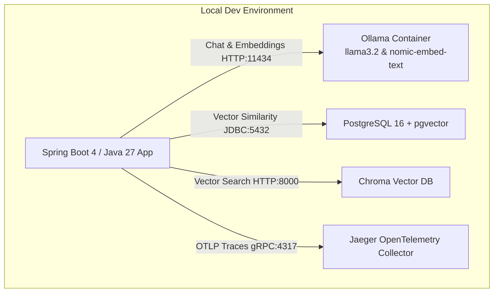

# Master Architecture & Implementation Plan: Spring AI Full Course (2026 Edition)

**Document ID**: PLAN-2026-SPRING-AI-EDU  
**Specification Ref**: [SPECIFICATION.md](file:///Users/aliturgutbozkurt/Desktop/spring-ai-edu/specs/SPECIFICATION.md)  
**Methodology**: Spec-Driven Development (SDD)  

---

## 1. Architectural Blueprint & Reactor Structure

The project is structured as a unified **Maven Multi-Module Reactor** to allow building all modules together or executing and testing individual modules in isolation.

```
spring-ai-edu (Aggregator Root)
│
├── shared-common/                             # Shared utilities, test harnesses, mock providers
│   ├── src/main/java/.../mock/                # Deterministic MockChatModel & MockEmbeddingModel
│   └── src/main/java/.../util/                # Token counting, formatting, assertions
│
├── module-01-foundations-and-models/          # Foundations, Model portability, ChatClient
├── module-02-prompt-engineering/              # Prompt templates, few-shot, system prompts
├── module-03-structured-output/               # BeanOutputConverter, JSON Schema, Record mapping
├── module-04-tool-calling-callbacks/          # Function calling, @Tool, dynamic API integrations
├── module-05-rag-and-vector-databases/        # Document ETL, Splitters, Embeddings, PgVector
├── module-06-advanced-rag-evaluation/         # Hybrid search, re-ranking, RAG Triad evaluation
├── module-07-multimodal-vision-audio/         # Vision, OCR, Whisper transcription, TTS
├── module-08-advisors-memory-history/         # ChatMemory, Advisors, windowing, persistence
├── module-09-mcp-model-context-protocol/      # Spring AI MCP Client & Server implementations
├── module-10-agentic-workflows/               # ReAct loops, supervisor agents, human-in-the-loop
├── module-11-security-and-observability/      # OWASP guardrails, Micrometer, Jaeger tracing
├── module-12-production-native-aot/           # GraalVM AOT, Docker multi-stage, Kubernetes
│
└── capstone-enterprise-ai-assistant/          # Comprehensive Full-Stack AI Copilot
```

---

## 2. Infrastructure & Local Developer Ergonomics Plan

To honor the **Zero-Cost Developer Experience** requirement, the repository provides a unified local infrastructure stack via Docker Compose:



### Spring Profiles Strategy
- **`local` (Default)**: Automatically configured to communicate with local Ollama (`localhost:11434`) and PgVector (`localhost:5432`). Students run `mvn spring-boot:run` and everything works out of the box.
- **`test`**: Activates `MockChatModel` and embedded `SimpleVectorStore` for fast, offline unit testing without external dependencies.
- **`openai` / `gemini` / `anthropic`**: Optional profiles that activate cloud APIs when students set environment variables (`OPENAI_API_KEY`, etc.).

---

## 3. Bilingual Courseware & PDF Engine Plan

### 3.1 Content Layout per Module
```
docs/
├── en/
│   ├── lesson-notes.md              # English lesson notes (Marp-formatted)
│   └── lesson-notes.pdf             # Pre-compiled English PDF
└── tr/
    ├── ders-notlari.md              # Türkçe ders notları (Marp formatında)
    └── ders-notlari.pdf             # Derlenmiş Türkçe PDF
```

### 3.2 Automated PDF Toolchain (`scripts/export-pdfs.sh`)
- Uses **Marp CLI** (`npx @marp-team/marp-cli`) or a Node/Chrome headless renderer to convert all Markdown notes into clean, beautifully styled slide decks and handbook PDFs.
- Fallback script generates formatted PDFs or HTML previews so students on any OS can read, print, or review offline.

---

## 4. Module Pedagogical Blueprint

Every module will be implemented following the standardized 5-layer structure:

| Layer | Path | Description |
|---|---|---|
| **1. Spec** | `specs/modules/module-XX.spec.md` | Granular specification of module objectives, schemas, edge cases. |
| **2. Notes (EN)** | `module-XX/docs/en/lesson-notes.md` | Comprehensive theory, code walkthrough, best practices in English. |
| **3. Notes (TR)** | `module-XX/docs/tr/ders-notlari.md` | Türkçe detaylı konu anlatımı, kod açıklamaları ve en iyi pratikler. |
| **4. Runnable Code** | `module-XX/src/main/java/...` | Fully functional, commented, enterprise-grade Spring Boot code. |
| **5. Homework & Solution** | `module-XX/homework/{starter,solution}` | Student starter project with failing tests + reference solution. |

---

## 5. Homework & Automated Grading Design

- **Starter Project (`homework/starter`)**:
  - Contains domain models, configuration templates, and stubbed service methods throwing `UnsupportedOperationException("TODO: Implement this method according to homework/README.md")`.
  - Includes a comprehensive JUnit 5 test suite that initially fails.
- **Solution Project (`homework/solution`)**:
  - Provides the complete, idiomatic solution.
  - 100% passing tests with assertions verifying correctness, edge cases, error handling, and prompt efficiency.
- **Bilingual Homework Guide**:
  - `homework/README.md` (English problem statement, constraints, rubric).
  - `homework/README_TR.md` (Türkçe problem tanımı, kısıtlar, değerlendirme kriterleri).

---

## 6. Implementation Phasing & Milestones

- **Phase 1: Project Scaffolding & Spec Foundation (Current)**
  - Initialize Git repository and create public GitHub repo via `gh`.
  - Establish `CLAUDE.md`, `specs/SPECIFICATION.md`, `specs/PLAN.md`, `specs/TODO.md`.
  - Set up root `pom.xml`, `docker-compose.yml`, helper scripts, and `shared-common`.
  - Populate GitHub Issues for milestone tracking.

- **Phase 2: Core Course Delivery (Modules 01 - 04)**
  - Module 01: Foundations, ChatClient, Model Providers (Ollama & Cloud).
  - Module 02: Advanced Prompt Engineering, Templates, Context.
  - Module 03: Structured Output with Java 27 Records & BeanOutputConverter.
  - Module 04: Dynamic Tool Calling & Function Callbacks.

- **Phase 3: RAG, Embeddings & Multimodal (Modules 05 - 08)**
  - Module 05: Document ETL & PgVector RAG.
  - Module 06: Advanced RAG, Hybrid Search & Automated Evaluation.
  - Module 07: Multimodal Vision, Audio (STT & TTS).
  - Module 08: Chat Advisors, Memory & State Management.

- **Phase 4: Advanced Systems & Production (Modules 09 - 12)**
  - Module 09: Model Context Protocol (MCP) in Spring AI.
  - Module 10: Autonomous Multi-Agent Workflows & ReAct Loop.
  - Module 11: Production Guardrails & Observability with Jaeger.
  - Module 12: GraalVM Native AOT & Cloud Deployment.

- **Phase 5: Capstone Project & Course Release**
  - Build `capstone-enterprise-ai-assistant`.
  - Generate and package all English & Turkish PDFs.
  - Validate end-to-end local test pass rate.
